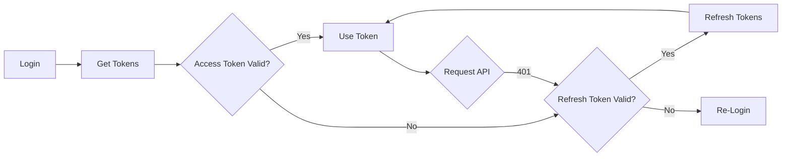

# Интеграция Keycloak в TutuEmployee

Полное руководство по интеграции авторизации через Keycloak в приложение TutuEmployee.

## 📋 Содержание

- [Обзор](#обзор)
- [Архитектура](#архитектура)
- [Настройка Keycloak](#настройка-keycloak)
- [Конфигурация приложения](#конфигурация-приложения)
- [Методы авторизации](#методы-авторизации)
- [Использование](#использование)
- [Безопасность](#безопасность)
- [Troubleshooting](#troubleshooting)

## 🎯 Обзор

Интеграция поддерживает следующие возможности:

- ✅ **Authorization Code Flow с PKCE** (рекомендуется)
- ✅ **Resource Owner Password Credentials** (для тестирования)
- ✅ **Автоматическое обновление токенов**
- ✅ **UserInfo endpoint** для получения данных пользователя
- ✅ **Logout** с отзывом токенов
- ✅ **Multiplatform** поддержка (Android, iOS, Web, Desktop)

## 🏗 Архитектура

### Структура компонентов

```
data/auth/
├── KeycloakConfig.kt           # Конфигурация Keycloak сервера
├── KeycloakTokens.kt           # Модели токенов
├── KeycloakTokenStorage.kt     # Хранилище токенов
├── KeycloakClient.kt           # HTTP клиент для Keycloak API
├── KeycloakOAuthHandler.kt     # OAuth flow обработчик
└── PKCEHelper.kt               # PKCE генератор

domain/
├── repository/AuthRepository.kt
└── usecase/auth/
    ├── LoginWithKeycloakUseCase.kt
    ├── GetKeycloakAuthUrlUseCase.kt
    └── HandleKeycloakCallbackUseCase.kt

presentation/auth/
├── AuthViewModel.kt            # ViewModel с Keycloak методами
└── AuthScreen.kt               # UI с кнопками авторизации
```

### Clean Architecture

```
┌─────────────────────────────────────────────┐
│         Presentation Layer                   │
│  ┌────────────────────────────────────┐     │
│  │  AuthViewModel                      │     │
│  │  - loginWithKeycloak()             │     │
│  │  - startKeycloakOAuth()            │     │
│  │  - handleKeycloakCallback()        │     │
│  └────────────────────────────────────┘     │
└─────────────────────────────────────────────┘
                    │
                    ▼
┌─────────────────────────────────────────────┐
│          Domain Layer                        │
│  ┌────────────────────────────────────┐     │
│  │  UseCases                          │     │
│  │  - LoginWithKeycloakUseCase        │     │
│  │  - GetKeycloakAuthUrlUseCase       │     │
│  │  - HandleKeycloakCallbackUseCase   │     │
│  └────────────────────────────────────┘     │
│                   │                          │
│  ┌────────────────────────────────────┐     │
│  │  AuthRepository (interface)        │     │
│  └────────────────────────────────────┘     │
└─────────────────────────────────────────────┘
                    │
                    ▼
┌─────────────────────────────────────────────┐
│           Data Layer                         │
│  ┌────────────────────────────────────┐     │
│  │  AuthRepositoryImpl                │     │
│  └────────────────────────────────────┘     │
│                   │                          │
│  ┌────────────────────────────────────┐     │
│  │  KeycloakClient                    │     │
│  │  - loginWithPassword()             │     │
│  │  - exchangeCodeForToken()          │     │
│  │  - refreshToken()                  │     │
│  │  - getUserInfo()                   │     │
│  │  - logout()                        │     │
│  └────────────────────────────────────┘     │
│                   │                          │
│  ┌────────────────────────────────────┐     │
│  │  KeycloakOAuthHandler              │     │
│  │  - createAuthorizationUrl()        │     │
│  │  - handleAuthorizationCallback()   │     │
│  └────────────────────────────────────┘     │
└─────────────────────────────────────────────┘
```

## ⚙️ Настройка Keycloak

### 1. Установка Keycloak

```bash
# Docker
docker run -p 8080:8080 \
  -e KEYCLOAK_ADMIN=admin \
  -e KEYCLOAK_ADMIN_PASSWORD=admin \
  quay.io/keycloak/keycloak:latest start-dev
```

### 2. Создание Realm

1. Войдите в Admin Console: `http://localhost:8080`
2. Создайте новый realm: **tutu**

### 3. Настройка Client

Создайте client с параметрами:

```yaml
Client ID: tutu-employee-app
Client Protocol: openid-connect
Access Type: public  # для мобильных/веб приложений
Standard Flow Enabled: ON
Direct Access Grants Enabled: ON  # для password flow (только для тестирования)
Valid Redirect URIs: 
  - tutuemployee://oauth/callback
  - http://localhost:*
  - https://your-app.com/*
Web Origins: *
```

### 4. Настройка Roles и Scopes

```yaml
Roles:
  - employee
  - admin
  - manager

Client Scopes:
  - openid
  - profile
  - email
  - roles
```

### 5. Создание пользователей

```yaml
Username: testuser
Email: testuser@tutu.ru
First Name: Тест
Last Name: Пользователь
Password: password123
Roles: employee
```

## 🔧 Конфигурация приложения

### 1. Обновите KeycloakConfig

```kotlin
// composeApp/src/commonMain/kotlin/ru/tutu/tutuemployee/data/auth/KeycloakConfig.kt

KeycloakConfig(
    serverUrl = "https://your-keycloak.com",  // Ваш Keycloak URL
    realm = "tutu",                            // Имя realm
    clientId = "tutu-employee-app",            // Client ID
    clientSecret = null,                       // null для public clients
    redirectUri = "tutuemployee://oauth/callback"
)
```

### 2. Настройте environment variables (опционально)

```bash
export KEYCLOAK_URL="https://keycloak.example.com"
export KEYCLOAK_REALM="tutu"
export KEYCLOAK_CLIENT_ID="tutu-employee-app"
```

### 3. Включите Keycloak в NetworkModule

```kotlin
// composeApp/src/commonMain/kotlin/ru/tutu/tutuemployee/di/NetworkModule.kt

const val USE_KEYCLOAK = true  // Включить Keycloak
```

## 🔐 Методы авторизации

### Authorization Code Flow с PKCE (рекомендуется для production)

**Самый безопасный метод для мобильных и веб приложений.**

```kotlin
// 1. Получить URL авторизации
viewModel.startKeycloakOAuth()

// 2. Открыть браузер с URL
val authUrl = uiState.keycloakAuthUrl
// Откройте браузер или WebView с authUrl

// 3. Обработать callback
viewModel.handleKeycloakCallback(callbackUrl)
```

**Преимущества:**

- ✅ Максимальная безопасность
- ✅ Client secret не нужен
- ✅ Защита от CSRF через state
- ✅ PKCE защищает от перехвата authorization code

### Resource Owner Password Credentials (только для тестирования)

**⚠️ Не рекомендуется для production!**

```kotlin
viewModel.loginWithKeycloak()
```

**Недостатки:**

- ❌ Приложение получает прямой доступ к паролю
- ❌ Не поддерживает MFA
- ❌ Не поддерживает Social Login
- ❌ Нарушает принцип OAuth2

## 📱 Использование

### ViewModel

```kotlin
class MyViewModel(
    private val loginWithKeycloakUseCase: LoginWithKeycloakUseCase,
    private val getKeycloakAuthUrlUseCase: GetKeycloakAuthUrlUseCase,
    private val handleKeycloakCallbackUseCase: HandleKeycloakCallbackUseCase
) : ViewModel() {

    // Password flow
    suspend fun loginWithPassword(username: String, password: String) {
        loginWithKeycloakUseCase(username, password)
            .onSuccess { (token, user) ->
                // Успешная авторизация
            }
    }

    // OAuth flow - шаг 1
    suspend fun startOAuth() {
        getKeycloakAuthUrlUseCase()
            .onSuccess { url ->
                // Откройте браузер с этим URL
            }
    }

    // OAuth flow - шаг 2
    suspend fun handleCallback(callbackUrl: String) {
        handleKeycloakCallbackUseCase(callbackUrl)
            .onSuccess { (token, user) ->
                // Успешная авторизация
            }
    }
}
```

### Repository

```kotlin
class MyRepository(
    private val keycloakClient: KeycloakClient
) {
    // Получить валидный токен (автоматически обновит если истек)
    suspend fun getValidToken(): String? {
        return keycloakClient.getValidAccessToken().getOrNull()
    }

    // Проверить авторизацию
    fun isAuthenticated(): Boolean {
        return keycloakClient.isAuthenticated()
    }

    // Выйти
    suspend fun logout() {
        keycloakClient.logout()
    }
}
```

### Compose UI

```kotlin
@Composable
fun AuthScreen(viewModel: AuthViewModel = koinViewModel()) {
    val uiState by viewModel.uiState.collectAsState()

    // OAuth через браузер
    LaunchedEffect(uiState.keycloakAuthUrl) {
        uiState.keycloakAuthUrl?.let { url ->
            // Откройте браузер или WebView
            openBrowser(url)
            viewModel.clearKeycloakAuthUrl()
        }
    }

    Column {
        // Username/Password форма
        OutlinedTextField(
            value = uiState.username,
            onValueChange = viewModel::onUsernameChange
        )
        
        OutlinedTextField(
            value = uiState.password,
            onValueChange = viewModel::onPasswordChange
        )

        // Кнопка входа через Keycloak (password)
        Button(onClick = { viewModel.loginWithKeycloak() }) {
            Text("Войти через Keycloak")
        }

        // Кнопка OAuth
        OutlinedButton(onClick = { viewModel.startKeycloakOAuth() }) {
            Text("Войти через браузер")
        }
    }
}
```

## 🔒 Безопасность

### Хранение токенов

**⚠️ ВАЖНО:** По умолчанию используется `InMemoryKeycloakTokenStorage`, который НЕ подходит для
production!

#### Production решения:

**Android:**

```kotlin
class SecureKeycloakTokenStorage(context: Context) : KeycloakTokenStorage {
    private val encryptedPrefs = EncryptedSharedPreferences.create(
        context,
        "keycloak_tokens",
        MasterKey.Builder(context).setKeyScheme(MasterKey.KeyScheme.AES256_GCM).build(),
        EncryptedSharedPreferences.PrefKeyEncryptionScheme.AES256_SIV,
        EncryptedSharedPreferences.PrefValueEncryptionScheme.AES256_GCM
    )
    
    override fun saveTokens(tokens: KeycloakTokens) {
        encryptedPrefs.edit()
            .putString("tokens", Json.encodeToString(tokens))
            .apply()
    }
}
```

**iOS:**

```swift
class KeychainTokenStorage: KeycloakTokenStorage {
    func saveTokens(tokens: KeycloakTokens) {
        let data = try! JSONEncoder().encode(tokens)
        let query: [String: Any] = [
            kSecClass as String: kSecClassGenericPassword,
            kSecAttrAccount as String: "keycloak_tokens",
            kSecValueData as String: data
        ]
        SecItemAdd(query as CFDictionary, nil)
    }
}
```

**Web:**

```kotlin
class SessionStorageTokenStorage : KeycloakTokenStorage {
    override fun saveTokens(tokens: KeycloakTokens) {
        window.sessionStorage.setItem(
            "keycloak_tokens",
            Json.encodeToString(tokens)
        )
    }
}
```

### PKCE

PKCE (Proof Key for Code Exchange) включен по умолчанию для Authorization Code Flow:

```kotlin
// Генерация code_verifier
val codeVerifier = PKCEHelper.generateCodeVerifier()

// Генерация code_challenge (SHA256 + Base64URL)
val codeChallenge = PKCEHelper.generateCodeChallenge(codeVerifier)

// Отправка в authorization endpoint
// code_challenge + code_challenge_method=S256

// Отправка в token endpoint
// code_verifier для верификации
```

### State параметр

Для защиты от CSRF атак используется случайный `state`:

```kotlin
val state = PKCEHelper.generateState()
// Проверяется при callback
```

## 🔄 Жизненный цикл токенов



### Автоматическое обновление

```kotlin
// KeycloakClient автоматически обновляет токены
val validToken = keycloakClient.getValidAccessToken()
    .getOrNull() // Вернет обновленный токен если старый истек
```

### Ручное обновление

```kotlin
keycloakClient.refreshToken()
    .onSuccess { newTokens ->
        // Токены обновлены
    }
    .onFailure {
        // Нужна повторная авторизация
    }
```

## 🧪 Тестирование

### Локальный Keycloak

```bash
# Запустить Keycloak в Docker
docker-compose up keycloak

# Или через docker run
docker run -p 8080:8080 \
  -e KEYCLOAK_ADMIN=admin \
  -e KEYCLOAK_ADMIN_PASSWORD=admin \
  quay.io/keycloak/keycloak:latest start-dev
```

### Тестовые пользователи

```kotlin
// Создайте тестового пользователя в Keycloak
Username: test@tutu.ru
Password: test123
```

### Unit тесты

```kotlin
class KeycloakClientTest {
    @Test
    fun `test token refresh`() = runTest {
        val client = KeycloakClient(mockHttpClient, config, tokenStorage)
        val result = client.refreshToken()
        assertTrue(result.isSuccess)
    }
}
```

## 🐛 Troubleshooting

### Ошибка: "Invalid redirect_uri"

**Решение:** Проверьте `Valid Redirect URIs` в настройках Keycloak client.

```yaml
Valid Redirect URIs:
  - tutuemployee://oauth/callback
  - http://localhost:*
```

### Ошибка: "Client authentication failed"

**Решение:** Для public clients установите `clientSecret = null`.

```kotlin
KeycloakConfig(
    clientSecret = null  // Для public clients
)
```

### Токены не сохраняются

**Решение:** Проверьте реализацию `KeycloakTokenStorage`.

```kotlin
// Используйте EncryptedSharedPreferences для Android
class SecureKeycloakTokenStorage(context: Context) : KeycloakTokenStorage {
    // Реализация с шифрованием
}
```

### CORS ошибки (Web)

**Решение:** Настройте Web Origins в Keycloak:

```yaml
Web Origins: *
# Или конкретные домены
Web Origins: 
  - http://localhost:3000
  - https://your-app.com
```

### Ошибка при SHA-256 (PKCE)

**Решение:** Используйте нативные криптографические библиотеки для каждой платформы.

## 📚 Дополнительные ресурсы

- [Keycloak Documentation](https://www.keycloak.org/documentation)
- [OAuth 2.0 RFC](https://tools.ietf.org/html/rfc6749)
- [PKCE RFC](https://tools.ietf.org/html/rfc7636)
- [OpenID Connect](https://openid.net/connect/)

## 🎯 Roadmap

- [ ] Биометрическая авторизация
- [ ] Social Login (Google, Facebook, etc.)
- [ ] Multi-factor Authentication (MFA)
- [ ] Single Sign-On (SSO)
- [ ] Token encryption at rest
- [ ] Certificate pinning

## 📝 Примеры конфигураций

### Production конфигурация

```kotlin
KeycloakConfig(
    serverUrl = "https://auth.tutu.ru",
    realm = "tutu-production",
    clientId = "tutu-employee-mobile",
    clientSecret = null,
    redirectUri = "ru.tutu.employee://oauth/callback"
)
```

### Development конфигурация

```kotlin
KeycloakConfig(
    serverUrl = "http://localhost:8080",
    realm = "tutu-dev",
    clientId = "tutu-employee-dev",
    clientSecret = null,
    redirectUri = "tutuemployee://oauth/callback"
)
```

---

## 💡 Лучшие практики

1. ✅ **Используйте Authorization Code Flow с PKCE**
2. ✅ **Храните токены в защищенном хранилище**
3. ✅ **Никогда не логируйте токены**
4. ✅ **Используйте HTTPS в production**
5. ✅ **Регулярно обновляйте зависимости**
6. ✅ **Настройте короткие сроки жизни токенов**
7. ✅ **Отзывайте токены при logout**
8. ✅ **Валидируйте redirect_uri на сервере**

---

**Автор:** TutuEmployee Development Team  
**Дата:** 2025  
**Версия:** 1.0.0
